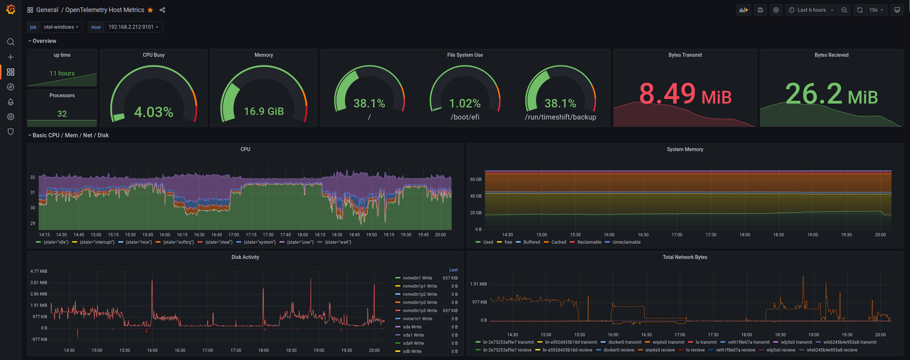
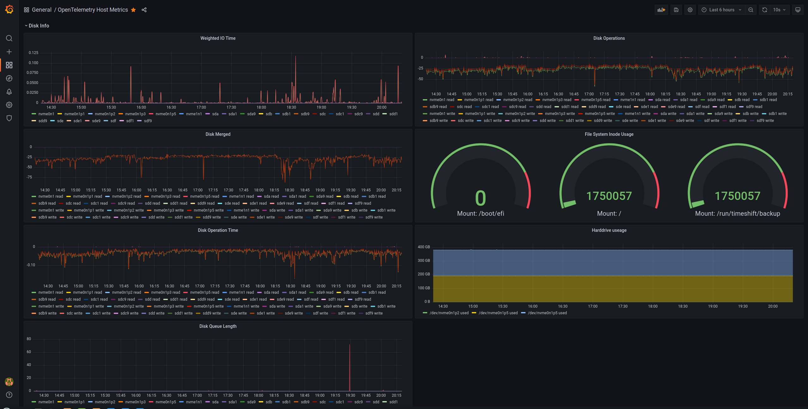

# Grafana Dashboard for OpenTelemetry Host Metrics 

Grafana dashboard for displaying metrics scraped from the OpenTelemetry Collector Host Metrics Reciver via Prometheus. 

## Screen Shots

## Currently supports the following scrapers
- CPU
- Disk
- FileSystem
- Memory

## References
- https://github.com/open-telemetry/opentelemetry-collector-contrib
- https://github.com/open-telemetry/opentelemetry-collector-contrib/tree/main/receiver/hostmetricsreceiver